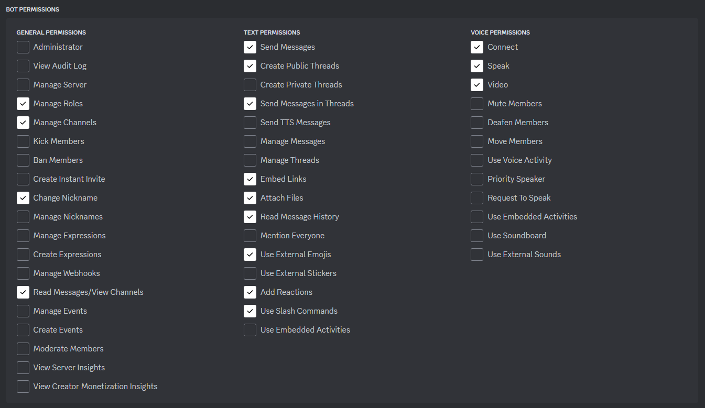

# Pittscord
A University of Pittsburgh Capstone Project Discord Bot

## Installation
First, create a python virtual environment, e.g.:
```
python3 -m venv venv
```
Then, activate the venv
### Unix and Mac
```
source venv/bin/activate
```
### Windows
```
.\venv\Scripts\activate
```
Next install the requirements
```
pip install -r requirements.txt
```
## Bot Creation
These are the minimum permissions required for the Discord bot to run properly:

### General Permissions
* Manage Roles
* Manage Channels
* Change Nickname
* Read Messages/View Channels

### Text Permissions
* Send Messages
* Create Public Threads
* Send Messages in Threads
* Embed Links
* Attach Files
* Read Message History
* Use External Emojis
* Add Reactions
* Use Slash Commands

### Voice Permissions
* Connect
* Speak
* Video



To create your own Discord bot, first ensure that your account has access to the Discord Development Portal.
Next, create a "New Application" and check that "Guild Install" is selected.
On the "OAuth2" tab, click "bot" and select the minimum permissions needed.
Enter the generated URL, and select the server you wish for your bot to run in.
Congrats! Your bot should have joined the server

## Discord Bot Warnings
If a bot-created role is ever moved above the role of the Discord bot, in terms of Discord roles and their priority, it will no longer have permissions to edit that role. So, make sure you do not.
If a permission is added to a student/TA role that the Discord bot cannot fulfill, the Discord bot will no longer be able to handle those roles administratively.

## Usage
Bot Invitation Link: https://discord.com/oauth2/authorize?client_id=1208123423763730434&permissions=311724199504&scope=bot
Click the above link to add our bot to your server. The bot expects a "Community Server", as it is requires access to forum channels. 

In order to work the bot:
First, edit config.py to have "abc123" as the admin.
Remember to be in a venv with the requirements installed.

Next, run the bot, either by executing the run_both.py or if you want to be able to run the web interface separate from the bot, ipc_server.py and in a separate terminal run web.py.
If you don't need the web interface at all, you can simply run bot.py. 

Then, /reregister @yourself to and reply to the bot to register your id, and then /configure_server to perform initial setup.
WARNING: /configure_server will alter the default role of the server, making most things not visible to a freshly joining user.
At that point, you should be able to use the web UI to perform management at-will.
It will make the rules channel visible and nothing else.
It will create two roles (Previous Student and Previous TA) which will serve as 'default' roles, but will be assigned by the bot.


### Configuration
In order to run the bot, there must be a `secret.py` containing the bot account's token, as well as your Canvas token.
The Discord token in `secret.py` must be edited/updated when creating a new bot account. Also, whenever you look at the Discord application's token on Discord, it changes, and so `secret.py` must be edited as well.

See `secret.example.py` for an example of what is expected.
